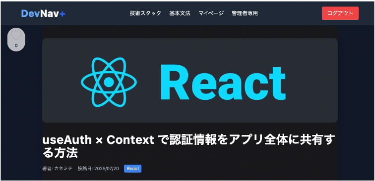
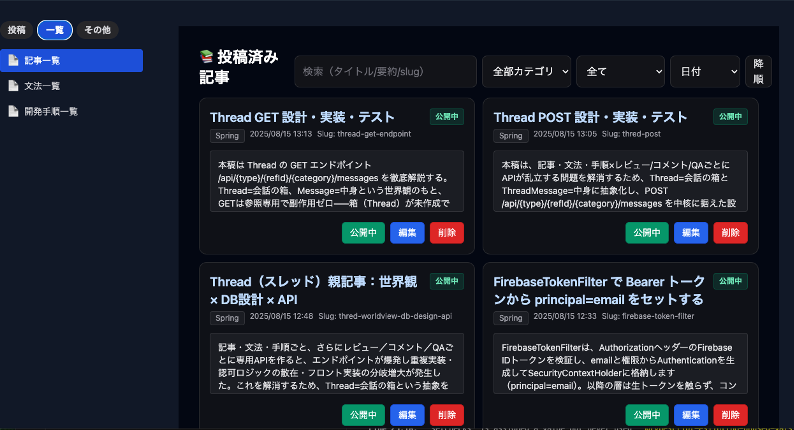

# DevNav+

**React × Spring Boot を日本語で学ぶための技術記事・開発手順サイト。**
フロントエンド（React / TypeScript）、バックエンド（Spring Boot / JPA）、認証（Firebase）、DB（PostgreSQL）、本番デプロイまでを個人で設計・実装・運用しています。

- **Live Demo**: https://devnav.tech
- **担当範囲**: 個人開発（企画・画面設計・Frontend・Backend・DB設計・インフラ構築・本番運用）
- **開発期間**: 2025年7月〜（初回コミット 2025-07-11）

| 区分 | 主な技術 |
|---|---|
| Frontend | React 18 / TypeScript / Create React App / Tailwind CSS / react-three-fiber |
| Backend | Java 17 / Spring Boot 3.5 / Spring Data JPA / Spring Security |
| Database | PostgreSQL（Neon） |
| Auth | Firebase Authentication / Firebase Admin SDK |
| Hosting | Vercel（Frontend） / Koyeb（Backend） / Cloudflare（DNS） |

---

## 目次
1. [Live Demo](#live-demo)
2. [What I Built / 主要機能](#what-i-built--主要機能)
3. [Tech Stack](#tech-stack)
4. [Architecture](#architecture)
5. [Engineering Highlights](#engineering-highlights)
6. [Testing](#testing)
7. [Production / Security](#production--security)
8. [Local Setup](#local-setup)
9. [Roadmap](#roadmap)

---

## Live Demo

- URL: https://devnav.tech
- 未ログインで記事・文法・開発手順の一覧と詳細を閲覧できます。いいね・読了・コメント・マイページはログイン後に利用できます。
- 公開中のコンテンツ数（2026年10月時点、本番APIで確認）: 技術記事 13 / 基本文法 9 / 開発手順 77
- Backend は Koyeb の無料枠で稼働しているため、しばらくアクセスがないと初回表示に時間がかかる場合があります。

| 技術記事の詳細 | 管理画面（記事一覧・公開切替・編集・削除） |
|---|---|
|  |  |

---

## What I Built / 主要機能

現在のコードに実装されている機能のみを記載しています。

### 閲覧（未ログイン可）
- 技術記事・基本文法・開発手順の一覧／詳細（ページング、カテゴリ、Markdown + シンタックスハイライト表示）
- 開発手順はステップ番号（例: `1-01`）順に並べて表示
- トップページの技術スタック表示を react-three-fiber（three.js）で3D描画し、画面幅に応じて縮小

### 学習者（ログイン後）
- Firebase Authentication（メールアドレス／パスワード）によるログイン・登録
- いいね（記事・文法）、読了の登録／解除（記事・文法・手順）
- コメント／Q&A スレッド（投稿・本人の投稿の編集／削除）
- マイページ: レベル／経験値バー、学習カレンダー、統計（読了・レビュー・いいね・コメント数）、いいねした記事、直近のアクション履歴

### 管理者（Firebase カスタムクレーム `admin`）
- 記事・文法・開発手順の作成／編集／削除、公開／非公開の切り替え、画像アップロード
- 記事・文法・手順へのレビュー点数の登録
- Q&A 管理画面（質問一覧と回答の登録）

---

## Tech Stack

| Layer | Technology |
|---|---|
| Frontend | React 18.3, TypeScript 4.9, react-scripts 5.0.1 (CRA), React Router 6, axios, Tailwind CSS 3, framer-motion, react-markdown + react-syntax-highlighter, three.js r171 + @react-three/fiber 8 |
| Backend | Java 17, Spring Boot 3.5.3, Spring Web, Spring Data JPA (Hibernate 6), Spring Security, Spring Boot Actuator, Lombok |
| Database | PostgreSQL 17（Neon） |
| Authentication | Firebase Authentication（Frontend）, Firebase Admin SDK 9.2（Backend での ID トークン検証） |
| Hosting | Vercel（Frontend）, Koyeb Buildpack（Backend）, Neon（DB）, Cloudflare（DNS） |
| Build | pnpm（Frontend）, Maven Wrapper（Backend） |

---

## Architecture

```text
[ Browser ]
    |  https://devnav.tech  (DNS: Cloudflare)
    v
+--------------------------+        HTTPS / JSON         +------------------------------+
| Vercel                   | --------------------------> | Koyeb                        |
| React + TypeScript (CRA) |  Authorization: Bearer      | Spring Boot (profile: prod)  |
| Firebase Auth (client)   |  <Firebase ID Token>        | FirebaseTokenFilter          |
+--------------------------+                             | Controller → Service → JPA   |
                                                         +---------------+--------------+
                                                                         | JDBC (TLS)
                                                                         v
                                                         +------------------------------+
                                                         | Neon (PostgreSQL)            |
                                                         +------------------------------+
```

- Frontend の API 接続先は環境変数 `REACT_APP_API_URL` で切り替えます。
- Backend の接続情報は `application-prod.properties` で環境変数（`SPRING_DATASOURCE_URL` / `SPRING_DATASOURCE_USERNAME` / `SPRING_DATASOURCE_PASSWORD`）から読み込み、Firebase の資格情報は `FIREBASE_SERVICE_ACCOUNT_JSON` から読み込みます。値は Git に含めず、各ホスティングサービスで管理しています。
- ヘルスチェック: `GET /actuator/health`

### 認証・認可の流れ
1. Frontend が Firebase Authentication でログインし、ID トークンを取得
2. API リクエストに `Authorization: Bearer <ID Token>` を付与
3. Backend の `FirebaseTokenFilter` が Firebase Admin SDK でトークンを検証し、Spring Security の認証情報（principal = email）を設定
4. カスタムクレーム `admin: true` を持つユーザーに `ROLE_ADMIN` を付与し、`/api/admin/**` を保護

### 主な API
| 種別 | Endpoint（抜粋） |
|---|---|
| 公開 | `GET /api/articles`, `GET /api/articles/{id}`, `GET /api/syntaxes`, `GET /api/procedures`（一覧は `page`, `size` 指定） |
| ログイン | `POST /api/likes`, `POST /api/{articles\|syntaxes\|procedures}/read`, `DELETE /api/{…}/read/{id}`, `GET /api/me`, `GET /api/user/stats`, `POST /api/{type}/{refId}/{category}/messages` |
| 管理者 | `POST /api/admin/add-article`（multipart）, `PUT /api/admin/articles/{id}`, `PUT /api/admin/articles/toggle/{id}` ほか |

---

## Engineering Highlights

- **Firebase ID トークンと Spring Security の統合**: 独自の `OncePerRequestFilter` でトークンを検証し、カスタムクレームからロールを付与。401 / 403 は JSON で返却。
- **公開 API からの個人情報除外**: 記事・文法・手順の DTO が投稿者のメールアドレスを JSON に含めていたため、`@JsonIgnore` で除外。Entity / Service / Controller は変更せず、レスポンスだけを変える最小差分とし、単体テストで回帰を防止（[Testing](#testing)）。
- **N+1 を避けた一覧取得**: 管理者向け Q&A 一覧で、`join fetch` と ID の一括取得（プロジェクション）を組み合わせて関連データを取得（`MessageService`）。
- **冪等性・同時実行への配慮**: いいね（文法）の `ON CONFLICT DO NOTHING`、既読・レビュー・スレッドのユニーク制約、スレッド作成時の競合で再取得する `getOrCreate`。
- **手順番号の数値ソート**: 文字列のステップ番号を正規化して数値カラムへ同期し（`StepNumber`）、既存データは専用プロファイルの移行処理で補完。
- **Frontend の体験改善**: 読了ボタンの楽観的更新と失敗時のロールバック、`AbortController` による競合リクエストの破棄、`React.lazy` によるルート単位のコード分割。
- **3D 表示のレスポンシブ対応**: three.js のテクスチャとして読み込めなかった SVG（`width` / `height` 未指定）を修正し、Canvas で見えている横幅に合わせてロゴ全体を縮小。

---

## Testing

| 種類 | 対象 | 内容 |
|---|---|---|
| 単体テスト（Backend） | `PublicDtoSerializationTest` | `ArticleDTO` / `SyntaxDTO` / `ProcedureDTO` を Spring の Jackson 設定で JSON 化し、`userEmail` が出力されないこと、`title` / `authorName` などの公開項目は維持されることを確認（3 テスト）。Spring Context・DB・Firebase を起動せずに実行可能。 |
| 起動テスト（Backend） | `TechApplicationTests.contextLoads` | Spring Context の起動確認。実行にはローカルの PostgreSQL と Firebase 資格情報が必要。 |
| 本番確認 | 公開 API 6 系統 | 記事・文法・手順の一覧／詳細 API で HTTP 200、`userEmail` 項目が存在しないこと、既存の公開項目が維持されていることを本番で確認。 |

```bash
cd backend
./mvnw -Dtest=PublicDtoSerializationTest test
```

Frontend の自動テストと CI（GitHub Actions）は未整備です（[Roadmap](#roadmap)）。

---

## Production / Security

本番運用中に発生した課題への対応です。秘密値・接続先ホスト名は記載していません。

1. **公開リポジトリに含まれていた DB 認証情報への対応**
   - 本番 PostgreSQL を READ ONLY 接続で監査し、ロール・publication / subscription / replication slot・event trigger・拡張機能・関数・トリガー・接続状況に不審な設定がないことを確認。
   - 変更前に `pg_dump`（custom format）で本番 DB を取得し、`pg_restore --list` で全テーブルのデータが含まれることを検証。
   - 漏えいした認証情報を rotation して無効化し、Neon と Koyeb の接続情報を新しい値へ切り替え。
2. **Backend デプロイ障害の切り分けと復旧**
   - リポジトリ名の変更後、Koyeb の GitHub App の repository 権限と、Service の Source が別リポジトリを参照していたことを特定。
   - 正しいリポジトリ（`dev_nav` / `main`）から再デプロイし、ローカルの使い捨てコンテナで起動を再現して、認証情報の不一致を原因として切り分け、復旧。
3. **Frontend 本番ビルドの復旧**
   - Vercel の CI 環境で ESLint の warning が error 扱いになり Production Build が失敗していた原因を切り分け、本番を復旧。
4. **公開 API からのメールアドレス除外**（[Engineering Highlights](#engineering-highlights) 参照）

---

## Local Setup

### 前提
- Java 17 / PostgreSQL / Node.js / pnpm
- Firebase プロジェクト（Email/Password 認証を有効化）とサービスアカウントの JSON

### Backend
```bash
cd backend
# dev プロファイル: localhost の PostgreSQL（application-dev.properties）を使用、ポート 8080
# Firebase 資格情報は環境変数 FIREBASE_SERVICE_ACCOUNT_JSON（JSON 文字列）などで指定
./mvnw spring-boot:run -Dspring-boot.run.profiles=dev
curl http://localhost:8080/actuator/health   # => {"status":"UP"}
```

### Frontend
```bash
cd frontend
pnpm install
# .env.local に REACT_APP_API_URL=http://localhost:8080 を設定
pnpm start   # http://localhost:3000
```

### 管理者ユーザー
管理画面を使うには、Firebase のユーザーにカスタムクレーム `admin: true` を付与します（Firebase Admin SDK の `setCustomUserClaims`）。

---

## Roadmap

- Frontend の ESLint warning 解消（CI で warning を error として扱える状態に戻す）
- CI（GitHub Actions）での Backend テスト・Frontend ビルドの自動実行
- 認可・入力検証のテスト拡充（`@WebMvcTest` など）
- DB マイグレーション管理（Flyway）の導入
- 画像アップロードの外部ストレージ化
